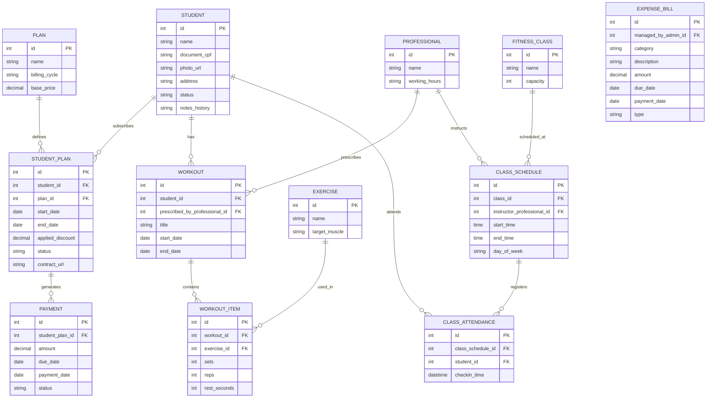

```mermaid
erDiagram
    STUDENT ||--o{ STUDENT_PLAN : subscribes
    PLAN ||--o{ STUDENT_PLAN : defines
    STUDENT_PLAN ||--o{ PAYMENT : generates

    STUDENT ||--o{ WORKOUT : has
    PROFESSIONAL ||--o{ WORKOUT : prescribes
    WORKOUT ||--o{ WORKOUT_ITEM : contains
    EXERCISE ||--o{ WORKOUT_ITEM : used_in

    FITNESS_CLASS ||--o{ CLASS_SCHEDULE : scheduled_at
    CLASS_SCHEDULE ||--o{ CLASS_ATTENDANCE : registers
    STUDENT ||--o{ CLASS_ATTENDANCE : attends
    PROFESSIONAL ||--o{ CLASS_SCHEDULE : instructs


    STUDENT {
        int id PK
        string name
        string document_cpf
        string photo_url
        string address
        string status
        string notes_history
    }

    PLAN {
        int id PK
        string name
        string billing_cycle
        decimal base_price
    }

    STUDENT_PLAN {
        int id PK
        int student_id FK
        int plan_id FK
        date start_date
        date end_date
        decimal applied_discount
        string status
        string contract_url
    }

    PAYMENT {
        int id PK
        int student_plan_id FK
        decimal amount
        date due_date
        date payment_date
        string status
    }

    EXPENSE_BILL {
        int id PK
        int managed_by_admin_id FK
        string category
        string description
        decimal amount
        date due_date
        date payment_date
        string type
    }

    PROFESSIONAL {
        int id PK
        string name
        string working_hours
    }

    EXERCISE {
        int id PK
        string name
        string target_muscle
    }

    WORKOUT {
        int id PK
        int student_id FK
        int prescribed_by_professional_id FK
        string title
        date start_date
        date end_date
    }

    WORKOUT_ITEM {
        int id PK
        int workout_id FK
        int exercise_id FK
        int sets
        int reps
        int rest_seconds
    }

    FITNESS_CLASS {
        int id PK
        string name
        int capacity
    }

    CLASS_SCHEDULE {
        int id PK
        int class_id FK
        int instructor_professional_id FK
        time start_time
        time end_time
        string day_of_week
    }

    CLASS_ATTENDANCE {
        int id PK
        int class_schedule_id FK
        int student_id FK
        datetime checkin_time
    }
```